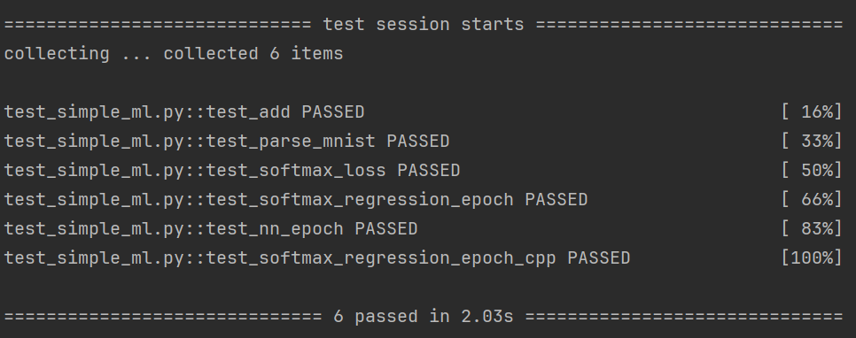

# Homework 0
Public repository and stub/testing code for Homework 0 of 10-714.

## Question 1: A basic `add` function, and testing/autograding basics

```python
def add(x, y):
    """ A trivial 'add' function you should implement to get used to the
    autograder and submission system.  The solution to this problem is in the
    the homework notebook.

    Args:
        x (Python number or numpy array)
        y (Python number or numpy array)

    Return:
        Sum of x + y
    """
    ### BEGIN YOUR CODE
    return x + y
    ### END YOUR CODE
```

## Question 2: Loading MNIST data

```python
def parse_mnist(image_filename, label_filename):
    """ Read an images and labels file in MNIST format.  See this page:
    http://yann.lecun.com/exdb/mnist/ for a description of the file format.

    Args:
        image_filename (str): name of gzipped images file in MNIST format
        label_filename (str): name of gzipped labels file in MNIST format

    Returns:
        Tuple (X,y):
            X (numpy.ndarray[np.float32]): 2D numpy array containing the loaded 
                data.  The dimensionality of the data should be 
                (num_examples x input_dim) where 'input_dim' is the full 
                dimension of the data, e.g., since MNIST images are 28x28, it 
                will be 784.  Values should be of type np.float32, and the data 
                should be normalized to have a minimum value of 0.0 and a 
                maximum value of 1.0 (i.e., scale original values of 0 to 0.0 
                and 255 to 1.0).

            y (numpy.ndarray[dtype=np.uint8]): 1D numpy array containing the
                labels of the examples.  Values should be of type np.uint8 and
                for MNIST will contain the values 0-9.
    """
    ### BEGIN YOUR CODE
    with gzip.open(image_filename, 'rb') as f:
        data = f.read()
        num_images = int.from_bytes(data[4:8], byteorder='big')
        num_rows = int.from_bytes(data[8:12], byteorder='big')
        num_cols = int.from_bytes(data[12:16], byteorder='big')
        images = np.frombuffer(data[16:], dtype=np.uint8).reshape(num_images, num_rows * num_cols)
        images = images.astype(np.float32) / 255.0

    with gzip.open(label_filename, 'rb') as f:
        data = f.read()
        labels = np.frombuffer(data[8:], dtype=np.uint8)

    return images, labels
    ### END YOUR CODE
```

## Question 3: Softmax loss

```python
def softmax_loss(Z, y):
    """ Return softmax loss.  Note that for the purposes of this assignment,
    you don't need to worry about "nicely" scaling the numerical properties
    of the log-sum-exp computation, but can just compute this directly.

    Args:
        Z (np.ndarray[np.float32]): 2D numpy array of shape
            (batch_size, num_classes), containing the logit predictions for
            each class.
        y (np.ndarray[np.uint8]): 1D numpy array of shape (batch_size, )
            containing the true label of each example.

    Returns:
        Average softmax loss over the sample.
    """
    ### BEGIN YOUR CODE
    exp_Z = np.exp(Z - np.max(Z, axis=1, keepdims=True))
    softmax_probs = exp_Z / np.sum(exp_Z, axis=1, keepdims=True)

    probs = softmax_probs[np.arange(len(y)), y]
    loss = -np.mean(np.log(probs))

    return loss
    ### END YOUR CODE
```

## Question 4: Stochastic gradient descent for softmax regression

```python
def softmax_regression_epoch(X, y, theta, lr = 0.1, batch=100):
    """ Run a single epoch of SGD for softmax regression on the data, using
    the step size lr and specified batch size.  This function should modify the
    theta matrix in place, and you should iterate through batches in X _without_
    randomizing the order.

    Args:
        X (np.ndarray[np.float32]): 2D input array of size
            (num_examples x input_dim).
        y (np.ndarray[np.uint8]): 1D class label array of size (num_examples,)
        theta (np.ndarrray[np.float32]): 2D array of softmax regression
            parameters, of shape (input_dim, num_classes)
        lr (float): step size (learning rate) for SGD
        batch (int): size of SGD minibatch

    Returns:
        None
    """
    ### BEGIN YOUR CODE
    for i in range(X.shape[0] // batch):
        batch_X = X[i * batch: (i + 1) * batch]
        batch_y = y[i * batch: (i + 1) * batch]
        XW = batch_X @ theta
        Z = np.exp(XW - np.max(XW, axis=1, keepdims=True))
        Z = Z / np.sum(Z, axis=1, keepdims=True)
        I_y = np.zeros(Z.shape, dtype=np.float32)
        I_y[np.arange(batch_y.size), batch_y] = 1
        xt = batch_X.T
        grad = np.matmul(xt, Z - I_y)
        theta -= lr / batch * grad
    ### END YOUR CODE
```

## Question 5: SGD for a two-layer neural network

```python
def nn_epoch(X, y, W1, W2, lr = 0.1, batch=100):
    """ Run a single epoch of SGD for a two-layer neural network defined by the
    weights W1 and W2 (with no bias terms):
        logits = ReLU(X * W1) * W2
    The function should use the step size lr, and the specified batch size (and
    again, without randomizing the order of X).  It should modify the
    W1 and W2 matrices in place.

    Args:
        X (np.ndarray[np.float32]): 2D input array of size
            (num_examples x input_dim).
        y (np.ndarray[np.uint8]): 1D class label array of size (num_examples,)
        W1 (np.ndarray[np.float32]): 2D array of first layer weights, of shape
            (input_dim, hidden_dim)
        W2 (np.ndarray[np.float32]): 2D array of second layer weights, of shape
            (hidden_dim, num_classes)
        lr (float): step size (learning rate) for SGD
        batch (int): size of SGD minibatch

    Returns:
        None
    """
    ### BEGIN YOUR CODE
    def ReLU(X):
        return np.maximum(0, X)

    def partial_ReLU(X):
        X[X <= 0] = 0
        X[X > 0] = 1
        return X

    for i in range(X.shape[0] // batch):
        batch_X = X[i * batch: (i + 1) * batch]
        batch_y = y[i * batch: (i + 1) * batch]
        preds = ReLU(batch_X @ W1) @ W2
        S = np.exp(preds - np.max(preds, axis=1, keepdims=True))
        S = S / np.sum(S, axis=1, keepdims=True)
        I_y = np.zeros(S.shape, dtype=np.float32)
        I_y[np.arange(batch_y.size), batch_y] = 1
        lo = S - I_y

        # W2
        left = ReLU(batch_X @ W1).T
        grad_w2 = np.matmul(left, lo)

        # W1
        left = partial_ReLU(batch_X @ W1)
        right = lo @ W2.T
        dp = left * right
        grad_w1 = batch_X.T @ dp

        W2 -= lr / batch * grad_w2
        W1 -= lr / batch * grad_w1
    ### END YOUR CODE
```

## Question 6: Softmax regression in C++

编译cpp文件可以直接运行 `src/setup.py`，不需要makefile。

这个cpp实现不大考虑运行效率，matrix类需要进行很多拷贝操作浪费性能。优化可以考虑把 `vector` 替换成 `mdspan`。

```python
template<typename T> struct matrix {
    size_t n, m;
    vector<vector<T>> a;

    matrix(size_t n_, size_t m_, int val = 0) : n(n_), m(m_), a(n_, vector<T>(m_, val)) {}

    matrix(const T* x, size_t n_, size_t m_) {
        n = n_, m = m_;
        a.resize(n, vector<T>(m));
        for (int i = 0; i < n; i++) {
            for (int j = 0; j < m; j++) {
                a[i][j] = *(x + i * m + j);
            }
        }
    }

    vector<T>& operator[](int k) { return this->a[k]; }

    matrix operator - (matrix& k) { return matrix(*this) -= k; }

    matrix operator * (matrix& k) { return matrix(*this) *= k; }

    matrix& operator -=(matrix& mat) {
        assert(n == mat.n);
        assert(m == mat.m);
        for (int i = 0; i < n; i++) {
            for (int j = 0; j < m; j++) {
                a[i][j] -= mat[i][j];
            }
        }
        return *this;
    }

    matrix& operator *= (matrix& mat) {
        assert(m == mat.n);
        int x = n, y = mat.m, z = m;
        matrix<T> c(x, y);
        for (int i = 0; i < x; i++) {
            for (int k = 0; k < z; k++) {
                T r = a[i][k];
                for (int j = 0; j < y; j++) {
                    c[i][j] += mat[k][j] * r;
                }
            }
        }
        return *this = c;
    }

    matrix<T> transpose() {
        matrix<T> result(m, n);
        for (int i = 0; i < m; i++) {
            for (int j = 0; j < n; j++) {
                result[i][j] = a[j][i];
            }
        }
        return result;
    }

    matrix<float> softmax() {
        matrix<float> result(*this);
        for (int i = 0; i < n; i++) {
            auto& v = result.a[i];
            auto mx = *std::max_element(v.begin(), v.end());
            for (auto& j : v) {
                j -= mx;
                j = std::exp(j);
            }
            auto exp_sum = std::accumulate(v.begin(), v.end(), (float)0.0);
            for (auto& j : v) {
                j /= exp_sum;
            }
        }
        return result;
    }
};

float ce_loss(matrix<float>& Z, matrix<uint8_t>& I_y) {
    int batch = Z.n;
    float sum = 0;
    for (int i = 0; i < batch; i++) {
        float v = Z[i][I_y[i][0]];
        v = -std::log(v);
        sum += v;
    }
    return sum / static_cast<float>(batch);
}

void softmax_regression_epoch_cpp(const float* X, const unsigned char* y,
                                   float* theta, size_t m, size_t n, size_t k,
                                   float lr, size_t batch)
{
    /**
     * A C++ version of the softmax regression epoch code.  This should run a
     * single epoch over the data defined by X and y (and sizes m,n,k), and
     * modify theta in place.  Your function will probably want to allocate
     * (and then delete) some helper arrays to store the logits and gradients.
     *
     * Args:
     *     X (const float *): pointer to X data, of size m*n, stored in row
     *          major (C) format
     *     y (const unsigned char *): pointer to y data, of size m
     *     theta (float *): pointer to theta data, of size n*k, stored in row
     *          major (C) format
     *     m (size_t): number of examples
     *     n (size_t): input dimension
     *     k (size_t): number of classes
     *     lr (float): learning rate / SGD step size
     *     batch (int): SGD minibatch size
     *
     * Returns:
     *     (None)
     */

    /// BEGIN YOUR CODE
    // X (m, n); y (m); theta (n, k);
    float alpha = lr / static_cast<float>(batch);
//    float loss = 0;
    for (int e = 0; e < m / batch; e++) {
        matrix<float> batch_X(X + e * batch * n, batch, n);
        matrix<unsigned char> batch_y(y + e * batch, batch, 1);
        matrix<float> t(theta, n, k);

        auto&& XW = batch_X * t;
        auto&& XT = batch_X.transpose();
        auto&& Z = XW.softmax();
        matrix<float> I_y(batch, k);
//        auto loss_i = ce_loss(Z, batch_y);
//        loss += loss_i;

        // X^T @ (Z - I_y)
        for (int i = 0; i < batch; i++) {
            I_y[i][batch_y[i][0]] = 1;
        }
        Z -= I_y;
        auto&& res = XT * Z;

        for (int i = 0; i < n; i++) {
            for (int j = 0; j < k; j++) {
                *(theta + i * k + j) -= res[i][j] * alpha;
            }
        }
    }
    /// END YOUR CODE
}
```

## Local Tests Passed


